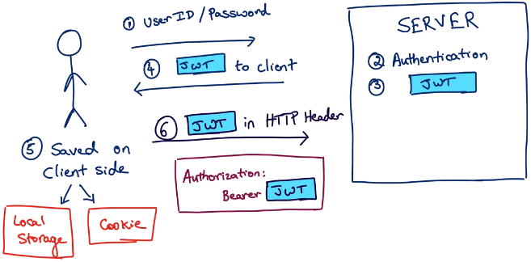
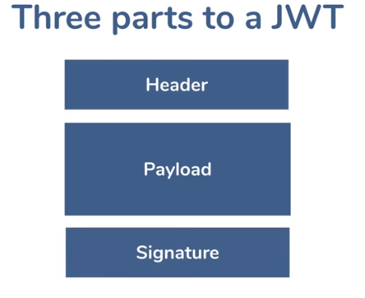
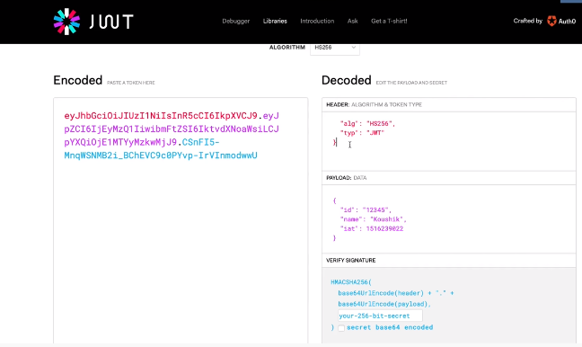
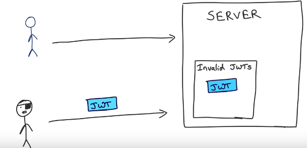
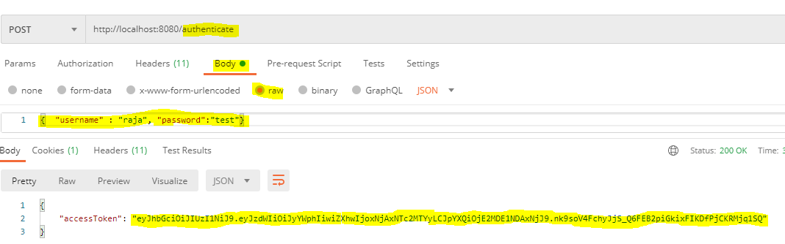
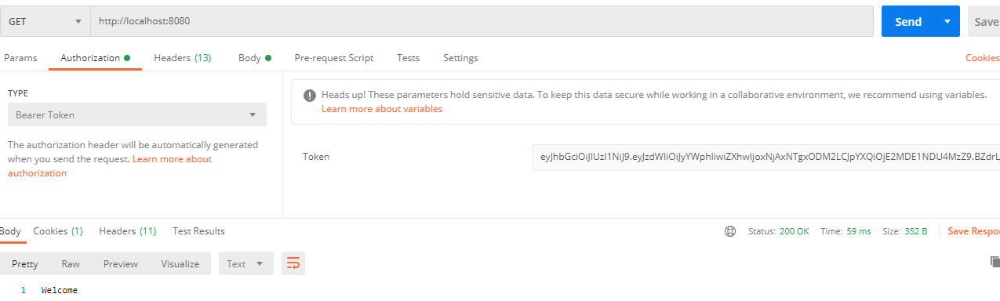

# Spring Boot Security
* [What Spring Security Can do?](#what-spring-security-can-do)
* [5 Core concepts in Spring Security](#5-core-concepts-in-spring-security)
* [How Spring Web Security Works?](#how-spring-web-security-works)
* [Spring Security Default](#spring-security-default)
* [JWT](#jwt)
* [OAuth](#oauth)
## What Spring Security Can do
* User name / password authentication
* SSO - LDAP ,Okta
* App level Authorization
* Intra App Authorization (OAuth)
* Micro Service Security (Using tokens JWT)
* Method level security

## 5 Core concepts in Spring Security
* Authentication 
* Authrization 
* Principal
* Granted Authority
* Roles								
											
**Authentication**<br>
* Verifying users identity (who is this user?)
* Knowledge based authentication (useraneme-password,secret question)
* Possession Based Authentication (token device,phone-text message)
* Multi factor Authentication -> Combination of more than one type of authentication
	
**Authorization**
* Are they allowed to do this?
* Can a authenticated user access particular resource.
* Is a authenticated uses has authority to check-out?

**Principal**
* Currently logged-in(Authenticated) user. 
* Once user is authenticated a principal is created, and it is used to get the user info throughout the session

**Granted Authority**
* GrantedAuthority is an privilege, an application can have multiple privilege(do_checkout,make_store_announcement,view_department_financials)
* In Spring Security, we can think of each GrantedAuthority as an individual privilege. Examples could include READ_AUTHORITY, WRITE_PRIVILEGE, or even CAN_EXECUTE_AS_ROOT. The important thing to understand is that the name is arbitrary.

**Roles**
* Group of authorities.
* Developer -> clone and pull request
* Lead -> clone , pull request and merge pull request.
 
## How Spring Web Security Works
When you add **security starter** to your pom,spring enabled authendication.
* It adds a **filter** which will intercept all the request (**Adds mandatory authentication for URLs**).<br>
 <br>

**Spring Security Default Behavior**
* Adds mandatory authentication for URLs
* Adds login form
* Handles login error
* Generates Default User - user
* Generates Default Password for user -> check in console log

## [Spring Security Default](01_spring-default-security)
By just adding **spring-boot-starter-security** to pom.xml, we can enable default security.
* Default user name is **user** and you can get the password from console during application start<br>

**Configure UserName and Password in application.properties** <br>
You can override **default credentials** in **application.properties**
```
spring.security.user.name=user
spring.security.user.password=test
```
## [Configure Authentication and Authorizaion](02_spring-security-inmemory)

* We can over ride default authentication by using **AuthenticationManager**.
* We have to create a class that extends **WebSecurityConfigurerAdapter** and override **configure(AuthenticationManagerBuilder auth)**, add **@EnableWebSecurity** to the class.
* By accessing **auth** object you can enable any type of authendication(**JDBC,LDAP etc**)
```
@EnableWebSecurity
public class InMemorySecurityConfig extends WebSecurityConfigurerAdapter{
	
	protected void configure(AuthenticationManagerBuilder auth) throws Exception {
		auth.inMemoryAuthentication()
		.withUser("raja")
		.password("{noop}test")
		.roles("ADMIN");
	}	
}

```
<br><br>
* We can configure Authorizaion by overriding **configure(HttpSecurity http)**
```
protected void configure(AuthenticationManagerBuilder auth) throws Exception {
		auth.inMemoryAuthentication()
		.withUser("raja")
		.password("{noop}test")
		.roles("ADMIN")
		.and()
		.withUser("srini")
		.password("{noop}test")
		.roles("USER");
	}
	
	protected void configure(HttpSecurity http) throws Exception {
	  http.authorizeRequests()
	  .antMatchers("/admin").hasRole("ADMIN")
	  .antMatchers("/user").hasAnyRole("USER","ADMIN")
	  .antMatchers("/").permitAll()
	  .and().formLogin();
	}

```
## [JWT](02_spring-security-jwt)
* **Jason Web Token** <br> <br>
 <br>

## JWT token has 3 parts 
 <br>
* **header**	-> token type algorithm used to sign 
* **payload****	-> values(userid, username,token creation time etc)
* **signature**	-> header and payload is encrypted with base64 and signature created using SECRET available in server. only server has the secret. <br>
 <br>
					   
## What happens when we access the resource with JWT token?	
* Server takes header and payload, create signature and verifies against signature stored in server.
* if payload is tampered then signature will be different.
		
## Disadvantage:	 
* payload is visible to everyone ,so we have to be careful on what we are sending in payload 
* Token is not tied with any user,so if someone steals the token they can also use the same until it get expired
* if token is stolen we can inform the auth server that token is stolen , so it will keep the token in invalid list <br>
 <br>

## JWT Authorization in Spring Boot App
**1. Create Rest API**
* Create RestAPI with **Web,Security** starters
* Create Endpoint for **helloworld(/)**
```
@GetMapping()
public String hello() {
	return "Welcome";
}
```
* Create Custom security for authentication
```
@EnableWebSecurity
public class HelloWorldSecurity extends WebSecurityConfigurerAdapter {
	@Autowired
	HardCodedUserDetailsService userDetailsService;
	protected void configure(AuthenticationManagerBuilder auth) throws Exception {
		auth.userDetailsService(this.userDetailsService);
	}	 
}
```
* Test **Hello** endpoint using custom auth form login **http://localhost:8080/**

**2. Implement Token Generation**
* Add **io.jsonwebtoken:jjwt:0.9.1,javax.xml.bind:jaxb-api:2.3.0** to pom or build.gradle
* Create **JWTUtil** class for **Create token,validata token,get userinfo from token**
```
//REFER SOURCE FOR FULL CLASS
@Service
public class JwtUtil {
    public String generateToken(UserDetails userDetails) {
        Map<String, Object> claims = new HashMap<>();
        return createToken(claims, userDetails.getUsername());
    }
    public Boolean validateToken(String token, UserDetails userDetails) {
        final String username = extractUsername(token);
        return (username.equals(userDetails.getUsername()) && !isTokenExpired(token));
    }
}
```
* Create **/authenticate** endpoint (authenticate user,	generate token and return it in response)
```
@PostMapping("/authenticate")
public ResponseEntity<AuthenticationResponse> authenticate(@RequestBody AuthenticationRequest request) {
	authManager.authenticate(new UsernamePasswordAuthenticationToken(request.getUsername(),request.getPassword()));
	final UserDetails userDetails = userDetailsService.loadUserByUsername(request.getUsername());
	final String accessToken = jwtUtil.generateToken(userDetails);
	return ResponseEntity.ok(new AuthenticationResponse(accessToken));
}
```
* allow **/authenticate** endpoint for non logged in users by overriding **configure(HttpSecurity http)**
```
protected void configure(HttpSecurity http) throws Exception {
	http.csrf().disable().authorizeRequests().antMatchers("/authenticate").permitAll().anyRequest().authenticated();	
}
```
* Test **Token Generation** in postman
 <br>

**2. Authorize Incoming Request with Filter**
* Create Filter by extending **OncePerRequestFilter**
```
//REFERE SOURCE FOR FULL CLASS
@Component
public class JwtRequestFilter extends OncePerRequestFilter {
  @Override
    protected void doFilterInternal(HttpServletRequest request, HttpServletResponse response, FilterChain chain)
            throws ServletException, IOException {    
	    //validate token
	    chain.doFilter(request, response);
	    }
}
```
* Configure **JwtRequestFilter** in Security class to intercept requests **http.addFilterBefore(jwtRequestFilter, UsernamePasswordAuthenticationFilter.class)**
```
protected void configure(HttpSecurity http) throws Exception {
	http.csrf().disable().authorizeRequests().antMatchers("/authenticate").permitAll().anyRequest().authenticated()
	//CALLING OUR JwtRequestFilter BEFORE UsernamePasswordAuthenticationFilter
	http.addFilterBefore(jwtRequestFilter, UsernamePasswordAuthenticationFilter.class);
}
```
* Test other endpoints with token.
 <br>

## [OAuth](02_spring-security-jwt)
OAuth is an open standard for access delegation, it was created for **authorization**.Now it is being used for SSO authentication also.
**OAuth Scenarios**
* OAuth Teriminologies
* [Client Credentials Flow](#client-credentials-flow) 
* [Authorization Code Flow](#authorization-code-flow)
* SSO
### Client Credentials Flow
Webservice to Webserice autoriztion(client id, secret)
 <br>
### Authorization Code Flow
One App need to access some resource from another app, but user will authenidcate this one(**ex an application asking access to google contact list**)
 <br>
**Detailed Flow**
 <br>
1. Spring Boot Configure Authentication 01_spring_boot_authentication
---------------------------------------------------------------------
	https://www.youtube.com/watch?v=iyXne7dIn7U
	
	Use Spring Provided Authentication
	
		1. Create Spring Boot Project With Starter Web and Starter Security
		2. Run the application you will get login screen login - You will be able to login
			user: user ,password: you will get it during deployment
			Using generated security password: 812d0dde-1131-46de-9ab0-f522b96f2fc3 (this will change on every deployment)
			http://localhost:8081/
			
	Custom user and password
		
		if required you can configure custom user and password in propertied
			spring.security.user.name=raja
			spring.security.user.password=test

		1. Configure credentials
		2. Restart the application and access it using credentials configured
			you will be able to access it
			http://localhost:8081/
		
	Custom Authentication:
		*Spring default authenticate has limitation has limitation, we can only have one use.
		We can provide custom authentication
			by extend WebSecurityConfigurerAdapter
			and over ride protected void configure(AuthenticationManagerBuilder auth)
		* add @EnableWebSecurity in security class, you can add it in boot main class also in that case w have 
		  annotate security class with @Configuration

2. Spring Boot Configure Authorization 02_spring_boot_authorization
-------------------------------------------------------------------

	https://www.youtube.com/watch?v=payxWrmF_0k
	
    * Authorization verify whether user(authenticated) has access to particular resource.
	
	* Let us to the following, create service with below 3 endpoints
		/ Every one can access (even if not logged in also)
		/user user and admin roles can access
		/admin only admin can access
		
	*BY DEFAULT AuthenticationManager AUTHROZIES ALL REQUEST,IT JUST CHECKS WHETHER USER LOGGED IN OR NOT,
	 IT DONT PROVIDE ROLE BASED AUTHORIZATION
	 
	* We can provide Customized Authentication 
		over riding configure(HttpSecurity httpSecurity)of WebSecurityConfigurerAdapter
		
	1. Create Spring Boot Project With Starter Web and Starter Security
	2. Create Resource class with 3 endpoints / ,/user,/admin
	3. Create Custom Security class extend WebSecurityConfigurerAdapter
		over ride  configure(HttpSecurity httpSecurity)
		protected void configure(HttpSecurity httpSecurity) throws Exception  {
		httpSecurity.authorizeRequests()
		.antMatchers("/admin").hasRole("ADMIN")
		.antMatchers("/user").hasAnyRole("USER","ADMINS")
		.antMatchers("/").permitAll()
		.and().formLogin();
		}
	4. while authorizing we have to start with most restricted url to list restricted.
	   in this example if put .antMatchers("/").permitAll() first other two items will not be verified,
	   every one will access everything so we have to be careful with authentication order
	   
	5.test
		http://localhost:8081/ --access with out login
		http://localhost:8081/user --only logged in users with user and admin role
		http://localhost:8081/admin --only logged in users with admin role
		
3. Spring JDBC Authentication with H2 in memory database 03_spring_security_jdbc
--------------------------------------------------------------------------------
	
	https://www.youtube.com/watch?v=LKvrFltAgCQ&t=111s
	
	Using DEFAULT Schema
	....................
	Storing credentials in DB
	*We will just tell spring where to look for credentials, we just need to override two methods
		configure(AuthenticationManagerBuilder auth) authentication
			auth.jdbcAuthendication 
		configure(HttpSecurity httpSecurity)  authorization
	
	1. Create Spring Boot Project With following starters
		Web
		JDBC
		Security
		H2
		
	2. Override authentication method
		protected void configure(AuthenticationManagerBuilder auth) throws Exception {
		
		UserBuilder users = User.withDefaultPasswordEncoder();
		auth.jdbcAuthentication()
		.dataSource(dataSource)
        .withDefaultSchema() //Security created default schema with below mentioned details
        .withUser(users.username("user").password("password").roles("USER"))
        .withUser(users.username("admin").password("password").roles("USER","ADMIN"));
		}
		
	3. Override authorization method same as 02_spring_boot_authorization example
	   configure(HttpSecurity httpSecurity)
	   while authorizing we have to start with most restricted url to list restricted.
	   in this example if put .antMatchers("/").permitAll() first other two items will not be verified,
	   every one will access everything so we have to be careful with authentication order
	   
	4.test
		http://localhost:8081/ --access with out login
		http://localhost:8081/user --only logged in users with user and admin role
		http://localhost:8081/admin --only logged in users with admin role
		
	Using DEFAULT Schema Explicit table creation
	............................................
	
	1. Create Spring Boot Project
	
	2. Create Tables
	
		*place schema.sql file in resource directory incase hsql
		refer boot documentation for table structure, it differs based on database type
		https://docs.spring.io/spring-security/site/docs/current/reference/htmlsingle/#user-schema
		create table users(	username varchar_ignorecase(50) not null primary key,password varchar_ignorecase(50) not null,enabled boolean not null);
		create table authorities (username varchar_ignorecase(50) not null,authority varchar_ignorecase(50) not null,constraint fk_authorities_users foreign key(username) references users(username));
		create unique index ix_auth_username on authorities (username,authority);
		
	3. INSERT data into table
		data.sql
		
	4. Override authentication method
	
		protected void configure(AuthenticationManagerBuilder auth) throws Exception {
		
		UserBuilder users = User.withDefaultPasswordEncoder();
		auth.jdbcAuthentication()
		.dataSource(dataSource)
		//IT IS NOT REQUIRED IF WE CREATE TABLE EXPLICITLY
		/*
		 * .withDefaultSchema()
		 * .withUser(users.username("user").password("password").roles("USER"))
		 * .withUser(users.username("admin").password("password").roles("USER","ADMIN"))
		 */
        ;		 
		}
	
	5. Override authorization method same as 02_spring_boot_authorization example	    
	   
	6.test
	
	Mapping Spring Security to custom table
	.......................................
	
	*Most of the time we will be using our own table in that scenario we just need to give query for user details and roles
		auth.jdbcAuthentication()
			.dataSource(dataSource)
			.usersByUsernameQuery("select username,password,enabled from users where username=?")
			.authoritiesByUsernameQuery("select username,authority from authorities where username=?")
	
	1. Create Spring Boot Project	 
		
	2. Override authentication method
	   configure(AuthenticationManagerBuilder auth)
	
	3. Override authorization method same as 02_spring_boot_authorization example	    
	   configure(HttpSecurity httpSecurity)
	   
	4.test
	
4. Spring Security By overriding UserDetailsService using JPA and MYSQL (04_spring_security_userdetailsservice_jpa)
-------------------------------------------------------------------------------------------------------------------
	
	https://www.youtube.com/watch?v=TNt3GHuayXs
	
	*Spring dont provide direct integration with JPA like it does for JDBC,we have to override user details service and provide it to authentication.
	Even if we are not doing spring internally used UserDatailsService,By overriding it we can provide custom implementation.
	
	Hard coding User Details in UserDetailService
	.............................................
	
	1. Create Spring Boot Project With following starters
		Web
		JPA
		Security
		MYSQL
		
	2. Override authentication method
		
		@Autowired
		UserDetailsService userDetailsService;	
		
		// WE ARE OVERIDING THIS METHOD TO PROVIDE CUSOTOM AUTHENDICATION.DEFAULT AUTHENDICATION JUST ALLOWS TO CONFIGURE SINGLE USER 
		@Override
		protected void configure(AuthenticationManagerBuilder auth) throws Exception {				
			auth.userDetailsService(userDetailsService);	 
		}
	 		
	3. Override authorization method same as 02_spring_boot_authorization example	    
	
	4. Provide Custom implementation for UserDatailsService 
		create class by implementing UserDetailsService 
		over ride method  UserDetails loadUserByUsername(String username) method
			hardcode list of user details
	5.Test
	   http://localhost:8081/ --access with out login
	   http://localhost:8081/user --only logged in users with user and admin role
	   http://localhost:8081/admin --only logged in users with admin role
	   
	USE JPA TO READ DATA FROM TABLE in UserDetailService
	....................................................
	
	1. Create Spring Boot Project as above		 
		
	2. Override authentication method as above			 
	 		
	3. Override authorization method as above		    
	
	4. Provide Custom implementation for UserDatailsService 
		create class by implementing UserDetailsService 
		over ride method  UserDetails loadUserByUsername(String username) method
			Read Data from table using JPA (Repository)
			
	5. Create TABLE and insert user data
		CREATE TABLE SPRING_SECUTIRY_USER (id int NOT NULL AUTO_INCREMENT,USER_NAME varchar(255) NOT NULL,PASS varchar(255),ROLES varchar(255),ACTVE boolean, PRIMARY KEY (id));
		insert into SPRING_SECUTIRY_USER  values (1,'raja','test','ROLE_USER,ROLE_ADMIN',true);
		insert into SPRING_SECUTIRY_USER  values (2,'arun','test','ROLE_USER',true);
		
	5.Test
	   http://localhost:8081/ --access with out login
	   http://localhost:8081/user --only logged in users with user and admin role
	   http://localhost:8081/admin --only logged in users with admin role

5. LDAP AUTHENDICATION
----------------------
	https://www.youtube.com/watch?v=-wDUChgvYgU
